# Task Manager App

## Overview

The Task Manager App is a powerful and efficient application designed to enhance your task management experience. With features such as signup, signin with email OTP verification, user profile creation, and task management with REST API integration, this app offers a seamless and secure user experience. Leverage shared preferences for persistent login and GetX for state management. Organize your tasks effortlessly, shift them between different sections, and enjoy the convenience of editing and deleting tasks.

## Features

- **User Authentication:** Secure signup and signin options with email OTP verification for enhanced security.

- **User Profile:** Create and manage your user profile to personalize your experience.

- **Task Management:** Add tasks seamlessly, automatically organized into the New Task section. Shift tasks between Cancelled, In Progress, and Completed sections.

- **Edit and Delete:** Have control over your tasks by editing details or removing them as needed.

- **Persistent Login:** Shared preferences remember user login information, eliminating the need to log in every time.

## Screenshots

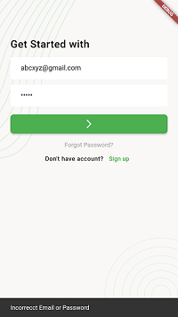
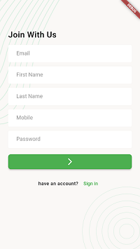
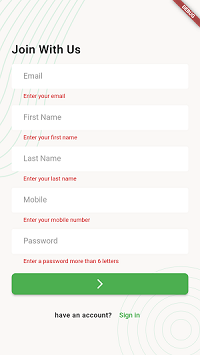
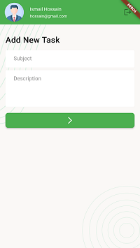
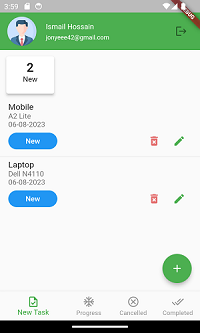
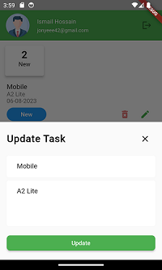
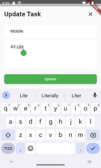
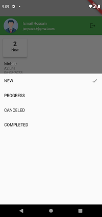
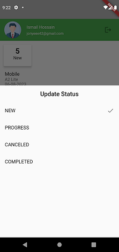
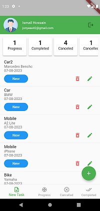
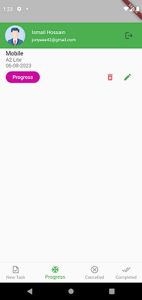
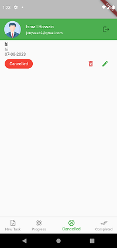
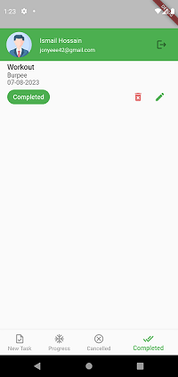
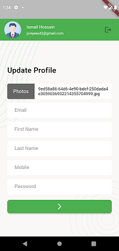
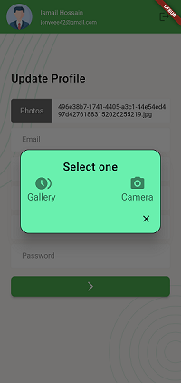

## Demo Video

[Watch Demo Video](https://drive.google.com/file/d/17y-efapkeHCqsFWu4WD4WSM3O_kcKvFS/view?usp=drive_link)

## Download

- [Download APK](https://drive.google.com/file/d/1nCb9oCENvfiFMbSP5W8H8EpWQrMM7QZ4/view?usp=drive_link)

## Technology Stack
- **State Management:** Utilizes GetX for efficient state management.

- **OTP Input:** Incorporates pin_code_fields for a secure and user-friendly OTP input.

- **Image Selection:** Implements image_picker for easy image selection.

- **Network Requests:** Uses http for making efficient network requests to the REST API.

- **Local Storage:** Leverages shared_preferences for storing user login information.

- **Image Caching:** Utilizes cached_network_image for efficient caching of network images.

- **Regular Expressions:** Implements regexpattern for pattern matching and validation.

## Packages Used
- **pin_code_fields - ^8.0.1**
- **image_picker - ^1.0.1**
- **http - ^1.1.0**
- **shared_preferences - ^2.2.0**
- **cached_network_image - ^3.2.3**
- **regexpattern - ^2.5.0**
- **get - ^4.6.5**
